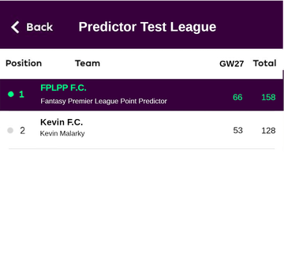

### FPL Point Predictor vs Human User  

#### 1. Main Hypothesis  
Most recreational PL Fantasy players use personal bias and favoritism when picking their weekly lineup for their Fantasy Football teams. In other words, people often base their decisions on which teams they support and on which players are the “hottest”, while sometimes not considering less popular players that are performing better.  

We believe that by removing bias and favoritism from the decision-making process with the use of our Fantasy Premier League Point Predictor App we can do better than most FPL managers that do not use our Predictor.  

### 2. The experiment
To test our hypothesis we felt the need to compare the results of our FPL Point Predictor against a real human FPL player so we decided to ask a friend which is incredibly passionate about Fantasy Football if he would take part of our experiment and build an FPL team and compete against our FPL Point Predictor with the same team selected by our friend for a total of 4 weeks, from Gameweek 25 to Gameweek 28 (inclusive). To make sure that our friend would take this challenge seriously, we promised him that if he beat our FPL Point Predictor at the end of the 4 weeks, we would take him out to dinner and pay for everything.  
 
### 3. The Rules  
The rules applied were the usual official Fantasy Premier League rules so our friend had to select a fantasy football squad of 15 players, consisting of 2 Goalkeepers, 5 Defenders, 5 Midfielder and 3 Forwards with a budget of £100 million.  
 
### 4. The Teams  
Before allowing our friend to select the 15 players for his team, we set up an official Fantasy Premier League competition with the two teams competing, the first being our friend’s team named “Kevin F.C” and the second team being the one representing our FPL Point Predictor named “FPLPP F.C”.  
 
### 5. Playing the Game  
After our friend selected the 15 players which would make up both teams, the competition finally began. Each Gameweek, in order to represent our FPLPP’s team, we would search for the point predictions of all the 15 players making up the team, and would then select the top 11 predictions (also according to the player position slots available) and put them in the “FPLPP F.C” lineup. This went on from Gameweek 25 to Gameweek 28 of the Premier League.  

### 6. The Results 

The results of the 4 Gameweeks were the following:
 
**Gameweek 25**:  
* FPLPP F.C. : 34 Pts  
* Kevin F.C. : 28 Pts  

   
  
**Gameweek 26**:  
* FPLPP F.C. : 58 Pts  
* Kevin F.C. : 47 Pts  

  

**Gameweek 27**:  
* FPLPP F.C. : 66 Pts  
* Kevin F.C. : 53 Pts  

 
 

**Gameweek 28**:  
* FPLPP F.C. : 40 Pts  
* Kevin F.C. : 22 Pts  

  

**Overall**:  
* FPLPP F.C. : 198 Pts  
* Kevin F.C. : 150 Pts  
 

### 7. Comparing the Results
As we can see above, the “FPLPP F.C” team obtained a total of 198 Points, compared to the 150 Points scored by “Kevin F.C”, which is a significant 48 Points difference in favour of the FPLPP team only over 4 Gameweeks!  

Although 4 weeks is not a sufficient time to allow to jump to conclusions, in this brief experiment we can see how the team in which the lineups were selected according to our Fantasy Premier League Point Predictor significantly outperformed the team controlled by our human friend.  

### 8. Conclusion  
Ideally a similar experiment would be performed over a  larger time span but due to time constraints this was not possible. Nevertheless, we still feel very confident about the assistance that our FPL Point Predictor can bring to FPL Players all over the world, and this experiment, although in a limited proportion, demonstrated it. We are very proud of the FPL Point Predictor App and also very grateful to it, no free dinner for you Kevin!
 
 
