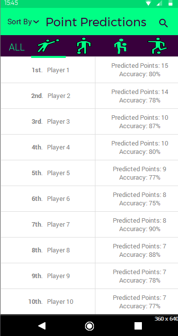
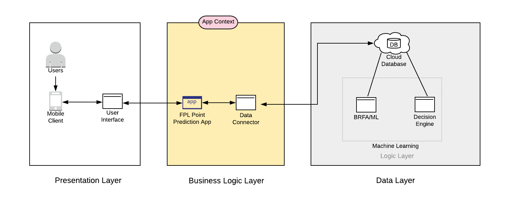
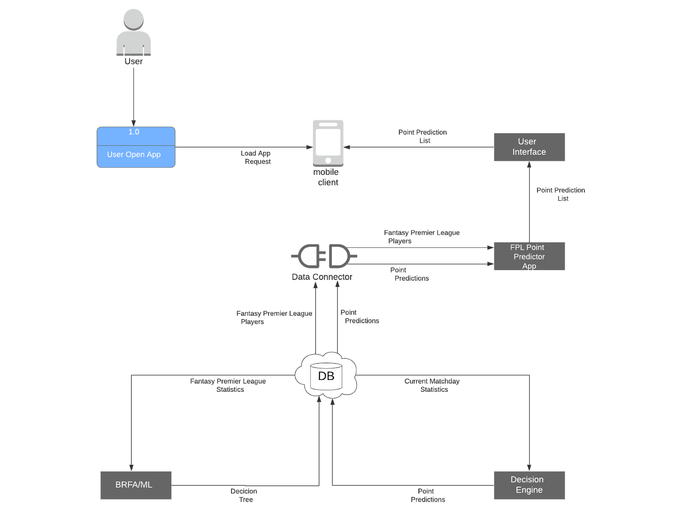
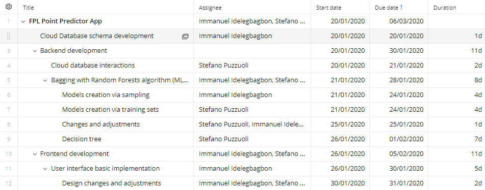
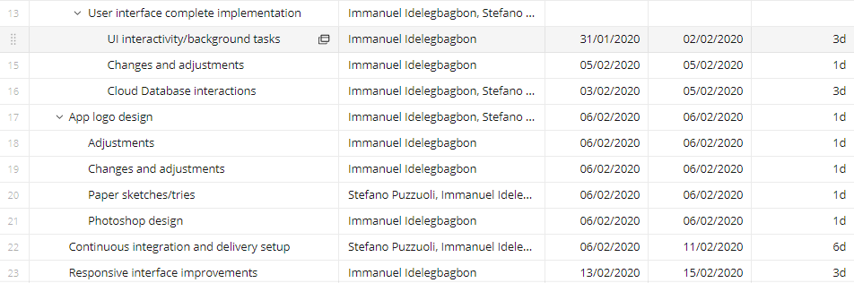
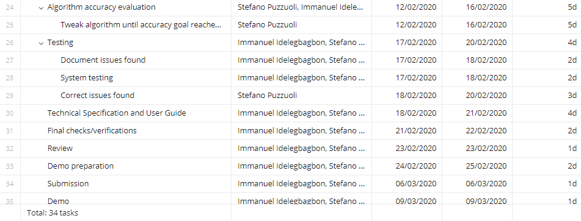
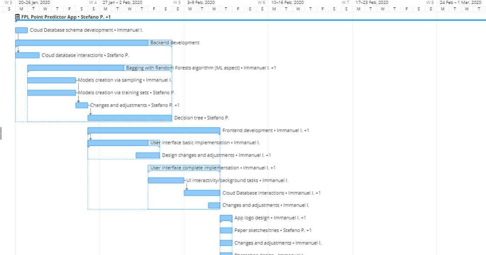
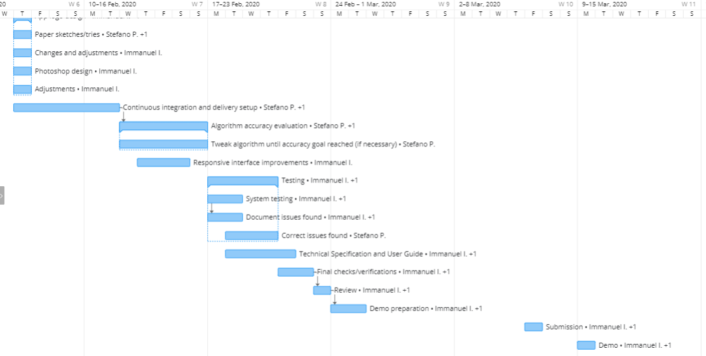

## CA326 Year 3 Project - Functional Specification
**Group Members**: Immanuel Idelegbagbon & Stefano Puzzuoli  
**Project Title**: Fantasy Premier League Point Predictor  

### Table of Contents
1. **Introduction**  
  1.1  Purpose  
  1.2. Scope  
  1.3. Definitions, Acronyms, and Abbreviations  
  1.4. References  
  1.5. Document Outline  
2. **The Overall Description**  
  2.1. Product Perspective  
  2.2. Product Functions  
  2.3. User Classes and Characteristics  
  2.4. Operating Environment  
  2.5. Constraints  
    &nbsp; &nbsp; 2.5.1. Time Constraint  
    &nbsp; &nbsp; 2.5.2. Predictions Constraint  
    &nbsp; &nbsp; 2.5.3. Cloud Storage Constraint  
    &nbsp; &nbsp; 2.5.4. Criticality of Application Constraint  

3. **System Requirements**  
  3.1. External Requirements  
    &nbsp; &nbsp; 3.1.1. User Interfaces  
    &nbsp; &nbsp; 3.1.2. Hardware Interfaces  
    &nbsp; &nbsp; 3.1.3. Software Interfaces  
    &nbsp; &nbsp; 3.1.4. Communication Interfaces  
  3.2. System Functions  
    &nbsp; &nbsp; 3.2.1. Fantasy Points Predictions Calculations  
    &nbsp; &nbsp; 3.2.2. Fantasy Points Predictions Accuracy Indicator  
    &nbsp; &nbsp; 3.2.3. Cloud Database Transactions  
    &nbsp; &nbsp; 3.2.4. UI to Visualise Point Prediction List  
    &nbsp; &nbsp; 3.2.5. Sort Point Prediction List  
    &nbsp; &nbsp; 3.2.6. Select List of Players by Position  
    &nbsp; &nbsp; 3.2.7. Search Players in List  
   3.3. Non-Functional Requirements  
    &nbsp; &nbsp; 3.3.1. Accuracy Requirements  
    &nbsp; &nbsp; 3.3.2. Performance Requirements  
    &nbsp; &nbsp; 3.3.3. Scalability Requirements  
    &nbsp; &nbsp; 3.3.4. Maintainability Requirements  
    &nbsp; &nbsp; 3.3.5. Portability Requirements  
    &nbsp; &nbsp; 3.3.6. Security Requirements  
   3.4. Other Requirements  
    &nbsp; &nbsp; 3.4.1. Cloud Database Requirements  
    &nbsp; &nbsp; 3.4.2. Internationalization Requirements  	
4. **System Architecture**  
  4.1. Architecture Diagram  
  4.2. Presentation Layer  
  4.2. Business Logic Layer  
  4.3. Data Layer  

5. **High Level Design**  
  5.1. Data Flow Diagram  

6. **Preliminary Schedule**  
  6.1. Project Plan  
  6.2. Gantt Chart  

### 1.     Introduction  
#### 1.1.  Purpose  
The following functional specification is designed to give an extensive overview of the proposed Fantasy Premier League Point Predictor Application. It consists of a listing and the corresponding descriptions of the core requirements and functionalities that the FPL point predictor app will necessitate. Regarding features for which possible, high-level descriptions of how they will be designed, managed and implemented will be provided. This document permits a rigorous assessment of the requirements before the designing/implementation of the system begins, in order to reduce later redesigning further on in the software development life cycle. Accessibility to this documentation will be limited to the software product developers, the project coordinator, the project supervisor, and any other member of Dublin City University staff that has an involvement in the CA326 module.

#### 1.2.  Scope  
The product to be discussed is a Fantasy Premier League Point Predictor Application. It consists of an Android app that, founded on the Fantasy Football statistics of the past and current season match fixtures of the Premier League, will formulate a point prediction for each individual player in a finite set, on each individual matchday, throughout the football year.
For each upcoming matchday, the application will allow the user to visualize an ordered list of a majority of the players of the Premier League, associating to each one their predicted points..
The application will not allow the users to manage their Fantasy Football teams (e.g. set their weekly-line up, transfer players, set their captain, etc.), alternatively, its main purpose is to assist them in their decisions when setting up their weekly line-up.
The goal is to implement a machine learning algorithm that will be so efficient to execute point prediction calculations for at least 18 players per team (396 in total) in the restricted amount of time. In any case, the players will be selected according to their number of appearances in the current season (at the time of implementation) in a descending order.
 

#### 1.3.  Definitions, Acronyms, and Abbreviations
**API**: Application programming interface.  
**App**: mobile application.  
**Client**: a third-party app used to play fantasy football.  
**Decision tree**: a decision tree is a decision support tool that uses a tree-like graph or model of decisions and their possible consequences, including chance event outcomes, resource costs, and utility.   
**Fantasy Football**: a competition in which participants select imaginary teams from among the players in a league and score points according to the actual performance of their players.  
**Fantasy Manager**: a Fantasy Football player.  
**FPL**: Fantasy Premier League.  
**GUI**: Graphical User interface.  
**Line-up**: the list of players taking part in a game.  
**Machine Learning**: application of artificial intelligence (AI) that provides systems the ability to automatically learn and improve from experience without being explicitly programmed.   
**Matchday**: the day on which a particular football match takes place.  
**Points**: the accumulated score a player receives each week.  
**Premier League**: top level of the English Football league system.  
**SQL**: Structured Query Language.  
**UI**: User interface.  
**UX**: User experience.  
 

#### 1.4.  References

- Micheal Richardson, Software Requirements Specification Guidelines	(http://www.michael-richardson.com/processes/rup_for_sqa/core.base_rup/guidances/guidelines/software_requirements_specification_91456CD0.html)

- Rohan Wadiwala, Cloud Database – DBaaS (Database as a Service), 2019
(https://labs.sogeti.com/cloud-database-dbaas-database-as-a-service/)

- Volodymyr Bilyk, The Essential Guide to Supervised Machine Learning, 2019
(https://theappsolutions.com/blog/development/supervised-machine-learning/#contents_3)

#### 1.5.  Document Outline
The rest of the document is laid out as follows:

**Section 2** is comprised of an overall description of the product. This section delves into the perspective of the product and briefly explains its functions, and additionally, a detailed outline of the user class and characteristics can also be found in this section. Furthermore, this section explains the operating environment of the product and any constraints that need to be taken into consideration during the design and implementation of the system.

**Section 3** contains system requirements that have been set for the product. It also contains a detailed and thorough explanation of the product’s functions.

**Section 4** revolves around the system architecture of the product. An architecture diagram is used to represent the structure of the system and is explained in detail here.

**Section 5** contains a high-level design of the system. It includes a model that shows the data flow within the system and the relationships between system components.

**Section 6** contains additional information on the software, hardware, and wetware requirements and a detailed preliminary schedule.

### 2. The Overall Description 

#### 2.1. Product Perspective  
The proposed product, the Fantasy Premier League Point Predictor Application is intended to be a stand-alone application. The purpose of the app is to predict the points each player in the Fantasy Premier League will score each week. The app is not intended to be used as a replacement for the Fantasy Premier League app nor as a client used to play Fantasy Football. The app can even be used by users in other innovative ways e.g. in their own played-on-paper fantasy league. In the future, with the correct resources, the app can be expanded and developed into a fully-fledged fantasy football client. The point predictor would then become a feature of the fully-fledged client. Many fantasy football client apps exist but not many feature a point predictor. Of the ones that do exist, predictions are not very accurate. Hence, this will be the driving force of the app. The product will be a point predictor and will focus on making predictions as accurate and efficient as possible. To do this, extensive research on machine learning will be required as the success of the machine learning algorithm and its decision tree will determine the accuracy of the predicted points.

#### 2.2. Product Functions
The app will have three main features. They are as follows:
  * Point prediction for each individual player every matchday.
  * Assist Fantasy Premier League managers in selecting their weekly line-up.
  * Accessible UI for all users.

These features will be expanded on and discussed more in depth in section 3 of this functional specification.  

#### 2.3. User Classes and Characteristics
As the product is an Android app intended to be used along with the Fantasy Football app or a client, the main users of the app will be players who play and understand the rules of Fantasy Football. These users will understand that the app being provided is not a means to play fantasy football but instead a means to aid and better one’s team. The user demographic will be broad and include male and female users starting from ages 3+.

The users will be expected to have hands-on experience and a familiarity with Android devices and the use of android apps. However, the simple user-friendly UI will make the app easily usable by users with little or no hands-on experience. Any disabilities will not inhibit or affect the type of user that can use the app by virtue of the app’s accessibility.

#### 2.4 Operating Environment

The application will support the latest version of Android OS and will be accessible by Android mobile devices that can run Android Kit-Kat 4.4 or later.

#### 2.5 Constraints
###### 2.5.1 Time Constraint
As this product is under a strict deadline set by DCU, making sure that all requirements are met and that the product is fully functionally within the given timeframe is an important constraint to be wary of.

###### 2.5.2 Predictions Constraint
The main feature of this app is making accurate point predictions for players. To accomplish this, the machine learning algorithm must create a decision tree. The efficiency of the machine learning algorithm and the accuracy of the decision tree as a collective is an essential constraint.

###### 2.5.3 Cloud Storage Constraint
Choosing the correct provider of cloud storage/database management and deciding how data will be transferred from the database to the app is another constraint.

###### 2.5.4 Criticality of Application Constraint
The final grade of the CA326 module is dependent on the development of this application.  

### 3. System Requirements  
#### 3.1. External Requirements
##### 3.1.1. User Interfaces
The product will include one single main user interface layout, which will contain an ordered list of all the players for which Fantasy Premier League points are being predicted, associating to each one their corresponding point projection and the overall accuracy of our predictions for that player up to that point in the season. The players will be sorted by default according to their points in a descending order. The main screen will provide a drop-down menu, on the top left of the layout, which will allow to select other criteria to sort the list by, specifically by points (the default), surname, and team name. The top right of the layout will also comprise a search button, which when clicked, enables the user to search and find any specific player in the overall list (it automatically scrolls the screen to the precise position the player searched is present), and an empty list is displayed if the player is not found. An additional aspect of the main user interface is the option to select the players that want to be viewed according to their position. Just above the list of players and their predicted scores, there will be a horizontal list that will allow the user to select between:

* All positions
* Goalkeepers
* Defenders
* Midfielders
* Attackers  

In this manner, the users will be able to specifically view the predictions amongst a more limited set of players, aiding them when selecting their Fantasy line-ups.

Throughout the development of the UI/UX of the product, we will be following the Android UI and UX guidelines, to ensure the most user-friendly, accessible experience possible for the users of the application. The specific Android guideline sections we will availing of are the following:

* Components
* Layout
* Animation
* Patterns
* Usability
* Accessibility

	
An example mock-up of the main interface of the application is as follows:  

##### 3.1.2. Hardware Interfaces
There will be no mandatory hardware interfaces to run/interact with the application.

##### 3.1.3. Software Interfaces
		
**Operating System: Android 4.4 KitKat or later versions**: The application will be supported by devices which incorporate Android 4.4 KitKat or later versions, up to Android 10. If newer versions are released during the development period, the app will be adjusted accordingly to make it compatible with them, but this will occur only if there is enough time.  
**Cloud Database: Google Cloud Platform - Cloud SQL**: The cloud database will be the component of the application in which most of the processing will occur and where a large majority of the data will be stored.  
Google Cloud Platform, through its Cloud SQL service, will provide an adequate solution to host our prediction engine which will be divided into two distinct parts. One of the parts will consist of the machine learning algorithm, which will receive the data from past games and then build the decision tree, which will be updated each week, according to the statistics of the most recent matchday. The second part of the prediction engine will instead store the data of all the players for which predictions are being calculated, it will store the data of the upcoming match fixtures, and finally, it will then apply these statistics to the decision tree in order to obtain the point predictions for the next matchday.

##### 3.1.4. Communication Interfaces
There will be no communication interfaces as all the information that the users will need will be presented in the application.

#### 3.2. System Functions
##### 3.2.1. Fantasy Points Predictions Calculations  
_3.2.1.1. Description_  
This is the main purpose of the application. For each upcoming matchday, founded on the decision tree created from the data of the past games, the system will perform confirmed calculations founded on a Bagging with Random Forests machine learning algorithm, and return a score prediction for each player in the confirmed set. This process will be applied for each matchday, the subsequent day that all the games in the previous matchday have terminated.
  
_3.2.1.2. Criticality_  
The point prediction calculation feature is essential to the application as it is the key functionality of the entire app. Without this aspect, the Fantasy Premier League Point Predictor app would not have any purpose as its complete aim is to provide this feature to its users.
  
_3.2.1.3. Technical Issues_  
One of the main issues when performing fantasy point calculations can be the inaccuracy of the results. Although the data being supplied to the machine learning algorithm is real and authentic, in some cases the model can still perform poorly and make predictions that are far from the actual points obtained by the players. An additional task to handle will be the computing power required by such calculations. Since the app will be managing and performing point predictions for a total of 396 players, it will be of the essence that the algorithm for the calculations be fast and efficient.
  
_3.2.1.4. Dependencies with other requirements_  
As this is the main feature around which the entire app functions, this aspect of the app highly depends on many other functionalities and requirements. For instance, in order to perform such calculations, the device on which the app is installed will require to communicate with the cloud relational database storing the data from past seasons. Additionally, to output the obtained predictions through the layout of the application, once the results have been calculated, they will be passed to the UI and displayed in a list.
  
##### 3.2.2. Fantasy Points Predictions Accuracy Indicator  
_3.2.2.1. Description_  
In addition to the point prediction for the upcoming matchday, each player will also have associated to them an accuracy indicator which will represent the level of accuracy of our predictions for that player up to the latest game. This value will aid users when selecting their starting line-up each week, by allowing them to understand if we generally underpredict, overpredict or predict exactly the points for a specific player. In this manner, when making their decisions, users can keep our accuracy indicator into account, and make line-up selection choices accordingly.
  
_3.2.2.2. Criticality_  
The point prediction accuracy indicator, although it will be a helpful feature for our users, it will not be an essential component of the application. As it will aid users in their weekly decisions, informing them of how precise our predictions are for each player, it is not a key functionality, as we expect users to still rely more significantly on the overall predictions for each individual matchday. Without such a feature, the app would still assist Fantasy Managers in their line-up decisions, which is the main goal.
  
_3.2.2.3. Technical Issues_  
This feature should not require many difficulties or issues. It will necessitate that the predictions and actual points of each week are kept into account, meaning that an additional table will be required in the cloud database to store the accuracy indicator for each player, and after every matchday, apply the new prediction/actual points percentage to each player and update the accuracy values appropriately.
  
_3.2.2.4. Dependencies with other requirements_  
Since to obtain and update the accuracy indicator values the predictions and actual results for each player must be considered, this functionality is highly dependent on the point prediction calculation feature. Additionally, it will also require the actual points players obtain for each matchday, so as a result, it will necessitate that these values are retrieved weekly. Furthermore, as the accuracy indicators will be displayed with the point predictions on the app in correspondence to each player, they will be stored in the cloud database and passed as the predictions will be to the UI and displayed in a list.
  
##### 3.2.3. Cloud Database Transactions  
_3.2.3.1. Description_  
In order to allow the machine learning algorithm to make point predictions for upcoming matchdays, prior to such calculations, it must be fed the statistics from the past games to enable it to learn from past data. In the case of our Fantasy Premier League Point Predictor app, the statistics from all the past games being considered will be stored in cloud database. When building the point prediction tree, the system will obtain tuples of data from the cloud database one after the other, build the tree at hand and then apply the new data to it, when making the future point predictions, each week.
  
_3.2.3.2. Criticality_  
Retrieving the data from past games to build the prediction tree is a very important aspect of the entire application. Since we will be dealing with large amounts of data, a database storage structure was mandatory. Without such a platform, it would be severely inconvenient to store all the data on a mobile device, and not having all this data would not be an option, as it is essential to allow the machine learning algorithm to learn from past situations.

_3.2.3.3. Technical Issues_  
In order to store and retrieve data from a cloud database, we will need to correctly purchase and set up a cloud database service. Issues that could be encountered when data is being transitioned from one location to another are potential bottlenecks in the cloud database server and upload/update intensive errors.
  
_3.2.3.4. Dependencies with other requirements_  
As the cloud database transactions will allow the machine learning algorithm to retrieve past data and learn from it, this functionality is very importantly associated to the point prediction feature. Consequently, errors in this part of the system would cause issues in the point projections and subsequently in outputting these results to the UI.
  
##### 3.2.4. UI to Visualise Point Prediction List  
_3.2.4.1. Description_  
Once the point predictions for each player have been calculated, a user interface that allows the application users to visualise a list of players and their corresponding projections is necessary. For this reason, the product will include one single main user interface layout, which will contain an ordered list of all the players for which Fantasy Premier League points are being predicted, associating to each one their corresponding point projection for the upcoming matchday.
  
_3.2.4.2. Criticality_  
As mentioned previously, the player point prediction feature is the main feature of the app, and consequently, as can be deducted, displaying such points is just as important. Therefore, displaying the projections is a key aspect that is essential to the application, since without this functionality, all the results obtained from the work “under the hood”, would not be able to be visualised by the users.
  
_3.2.4.3. Technical Issues_  
As this aspect of the app consists solely of displaying a list of players with their associated point prediction, the issues encountered should be limited. The correct implementation of such a feature is required, with the use of Android Studio, and matching each player with their corresponding prediction will be necessary. 

_3.2.4.4. Dependencies with other requirements_  
As this aspect will be displaying all the players and their point predictions, it will be in close association with the part of the application which calculates the actual results. Without this interdependence, the UI would not have the values to display.
  
##### 3.2.5. Sort Point Prediction List  
_3.2.5.1. Description_  
As previously mentioned, the main user interface layout will consist of a list of players ordered in a descending manner according to their point predictions. The application will consist of a drop-down menu, located at the top left area of the screen layout, which will enable the user to select what element to sort the list by, amongst points (default choice), players surnames, and team names.
  
_3.2.5.2. Criticality_  
This feature will be present to accommodate the users’ preferences, allowing them to visualise the list in different orders, as different people, could make use of the app in different manners. Such a functionality is not essential to the main purpose of the application and will be present, to aid the distinct types of users, when making use of the product. Without this aspect, the app would still satisfy its goal.

_3.2.5.3. Technical Issues_  
Such a feature could be quite straightforward to implement but it will be essential to assure that the drop-down button/menu will be accessible to all users of the application. For this reason, when implementing this aspect of the UI, all Android guidelines for accessible drop-down menus will be followed, step by step, to allow a user-friendly experience to all users.

_3.2.5.4. Dependencies with other requirements_  
Since this feature will determine in what order the list of players will be presented, it is associated very closely with the UI that displays such a list. 
  
##### 3.2.6. Select List of Players by Position  
_3.2.6.1. Description_  
An additional option the users will have when viewing the list of players with their corresponding points predictions will be the possibility to select what players to view according to their position in Fantasy Football which differs between Goalkeeper, Defender, Midfielder and Attacker. There will also be the option to view all the players, without distinction of role, and this will be the default selection. These options will be organised in a horizontal list present just above the list of players and an example of such can be viewed in section “3.1.1. User interfaces”, where a UI mockup can be found.
  
_3.2.6.2. Criticality_  
As for the sort-by option described previously, this feature will be present to accommodate the users’ preferences and will not be essential to the main purpose of the application.
  
_3.2.6.3. Technical Issues_  
The risks that were mentioned for the sort-by menu above apply to this feature too. It will be important to guarantee that the list of positions will be accessible to all users and the guidelines mentioned above will also be followed when implementing this aspect of the app.
  
_3.2.6.4. Dependencies with other requirements_  
Since this feature will determine what players will be present in the list, it is associated very closely with the UI that displays it.
  
##### 3.2.7. Search Players in List  
_3.2.7.1. Description_  
When the list of players in being displayed through the UI, the user will have the option to search for any specific player through a search button present at the top right of the screen. This feature will allow the user to enter characters in the search box, querying the database of players after each individual character entry or deletion, and output the list of players that match to the string entered by the user. The search bar will also extend a list of player names that the user could be looking for when entering the string. For instance, when the user types “Magui”, the search bar will extend a small list of players that contain the string “Magui” in their surnames, if any.
  
_3.2.7.2. Criticality_  
This feature, although not as essential as the displaying of the list of players with their corresponding point predictions, is quite important, since without it, the user would be obligated to scroll amongst a list of 396 players (if viewing all positions) to find a specific player they are looking for. For this reason, if this functionality was not present, the app would still serve its purpose, but it would be doing it by providing a very cumbersome UI and usability to the users.
  
_3.2.7.3. Technical Issues_  
Implementing this feature should not involve many difficulties but it will be necessary to assure correct accessibility of the button, the displaying of the keyboard when the button is clicked and verify that the correct queries are being made to the database at the correct time when characters are being entered and deleted. 
  
_3.2.7.4. Dependencies with other requirements_  
As for the previous two features, the search functionality will be closely connected to the UI that displays the list of players (through the database which it will query when names are being searched).

	
#### 3.3. Non-Functional Requirements
  
##### 3.3.1. Accuracy Requirements
As the entire application is based around the point predictions for the Fantasy Premier League players, it is clear how the accuracy of the predictions will significantly impact the overall outcome of the final product. For this reason, increasing the predictive capabilities of the algorithm at hand will be one of our leading concerns. 
  
The first aspect to focus on is the quantity of the data being used to train the model. The amount of statistics being utilized will include all of the Fantasy Premier League data from the past season, with the first 70% of the overall, being used as the training set to build the decision tree. When then applying the remaining 30% of the data, the accuracy of the model shall reach at least 80% correct predictions, with a correct prediction being labelled as a point projection that is within 1.5 points (plus or minus) of the real value. If this percentage is not satisfied, some algorithm tuning will be applied, by either interchanging some parts of the training data and test data, or by manually tweaking some aspects of the model. If this target cannot be reached within the time constraints, a 70% accuracy could be accepted.
  
##### 3.3.2. Performance Requirements
One of the most important aspects to consider when developing the Fantasy Premier League Point Predictor Application is the performance. As the system will be managing such large quantities of data, assuring the computations and transactions are performed efficiently and in non-critical moments will be essential to guarantee a quality user experience.
  
Although building the decision tree with the training set could have caused some significant overhead, this will not be an issue as the tree will be created the one single time before the app is available to the users. An issue that cannot be overlooked, alternatively, is applying the machine learning algorithm to the data for each upcoming matchday. This process will occur the following day that all the games from the previous matchday have terminated. Since this process could potentially take between 5 and 15 seconds (depending on the efficiency of the algorithm), the system will calculate all the point predictions of the upcoming matchday while the projections for the previous week are still being displayed, and only once all the calculations have been completed and stored in the cloud database, the app will replace the old matchday predictions with the new ones, which shall require less than 1.0 seconds.
  
The other minor functionalities which are sorting the list by different elements, selecting the players to view by role, and searching the players by name, involve simple database queries and shall also take no longer than 1.0 seconds.
  
Overall, aside from applying the new weekly data to the machine learning decision tree which will be performed without the user being alerted, the other interactions that the user will have with the app should be quite immediate and allow the user to have a friendly experience with the point prediction app.
  
##### 3.3.3. Scalability Requirements
Since the application will be handling a limited number of players (396 overall), it is immediately clear that in the future, it could potentially be extended to handle a larger quantity of point predictions, up to even all the players of the Premier League. As the scalability required is often driven by the lifespan and the maturity of the system, the correct, cautious measures of the workload will need to be applied.
  
In one respect, this will require to design the current project in a manner that will allow for future increase of the system workload, without redesigning the entire application and model. 
  
If the application reaches our set quantity user goals (by the end of the current season), it could be extended to handle all the players in the league by the beginning of the 2020/2021 Premier League season. To then manage all the additional data, user requests, additional processing and transactions, the cloud server storage space would be doubled by simply acquiring the extra storage space (one main advantage of cloud databases, and if necessary supplementary optimizations could be applied to the machine learning model, in order to still reach the minimum performance requirements that are currently set.
  
##### 3.3.4. Maintainability Requirements
As maintenance is a key concept for almost any software application, designing the system to have a high maintainability level will be essential. Maintainable software is easy to extend and fix, and this will encourage the software’s uptake and use. The modular design that our system will have, with the three main components of it being all separate and distinct (UI, machine learning model, and the cloud database), will simplify the handling of issues in any of the segments, and in most cases, it will be clear where a particular problem occurs, if it does.
  
Additionally, once the system is set up and running as desired, all the actions necessary will be automated, and a manual aid will only be needed when larger, unexpected issues occur. Such situations should not arise, but in case the unexpected happens, if the time constraints allow it, we will implement a feature in the app to send notifications to users to inform them that the system is currently unavailable.
  
##### 3.3.5. Portability Requirements
It is not an explicit design goal for the application to be directly portable to other platforms. When designing and implementing the Fantasy Football Point Predictor application, it will be specifically planned and modelled for Android systems exclusively.
  
##### 3.3.6. Security Requirements
Given the application will only be providing fantasy football point predictions for its users, without requiring any sort of authentication or authorization, it will not be storing sensitive data and, consequently, security is not seen as an area of major concern.
  
Furthermore, since the app will not be interacting with any other explicit device components (eg. camera, microphone, etc.), it is not necessary to request these permissions from the user. The only device feature that the app will require, is the Internet access, for which the permissions is generally automatically granted, but for specific scenarios where this is not the case, the user will be prompted to approve the request of Internet usage, and if the permission is denied, the app will immediately close.
  
Regarding the communication with the cloud database, we will be making use signature-based permissions. These permissions don't require user confirmation and instead check that the apps accessing the data are signed using the same signing key. Therefore, these permissions offer a more streamlined, secure user experience.
  
Since the app will not require to receive data from other external applications on the device, other apps will explicitly be disallowed to access the ContentProvider objects that the point prediction app contains. This setting will guarantee additional security especially to devices running Android 5.1.1 or lower, as the android:exported attribute of the <provider> element is true by default on those versions of Android.
  
#### 3.4. Other Requirements
##### 3.4.1. Cloud Database Requirements
As mentioned in section 3.1.3., the cloud database being used to store the large quantities of data for the system is Google Cloud Platform, through its Cloud SQL service.
  
It is essential that the cloud database being used provides the following features:

* Fully managed MySQL Community Edition databases
* Minimum 400 MB of RAM
* Standard GB/month PD storage
* Continuous support/availability
* Portable API
* Results Visualisation
* Automation modules
* Automated and on-demand backups, and point-in-time recovery.

##### 3.4.2. Internationalization Requirements
As Fantasy Premier League is a game played by users all over the world, the application will follow the standard Android Internationalization guidelines and will support the following languages:
  
* English
* Italian
* German
* French
* Portuguese
* Spanish
		

The language of the application will be set by default according to the language the device on which the app is installed on is set to.

### 4. System Architecture
#### 4.1. Architecture Diagram

  

The above architecture diagram is a representation of how the product interacts with users, entities and data sources. The diagram includes three layers. These layers depict a breakdown of the various components that make up the product. The first layer is the presentation layer. This layer contains components related to user interaction with the application. Next is the business logic layer, in which we find the core functionality of the application. Finally, the lowest layer called the data later, contains components responsible for communicating with the data storage. 

#### 4.2. Presentation Layer 
The Presentation layer is responsible for displaying data. It consists of the user interface component, the user and the mobile client. The user interface is the only means for the user to interact with the application. The user does this by using their mobile client to access and utilise the features offered by the user interface. Data usually flows from the application to the user but in some case the user can also input data into the application. These cases include filtering the list of predicted points and searching for specific players.

	
#### 4.3. Business Logic Layer
Within the Business Logic layer lies the main function of the system - the FPL Point Predictor App along with the data connector. The Business Logic layer provides data that is required by the presentation layer. It is also responsible for fetching data from the Data layer and performing necessary tasks with the data before updating the data. The data is then either sent to the Presentation layer or back to the Data layer. The data is transferred to and fro using the data connector. In the case of the product at hand, data will consist of players and their predicted points.

#### 4.4. Data Layer
The Data layer consists of a cloud database that will be used to store all data regarding previous and current Fantasy Premier Leagues matches, the machine learning algorithm that will be used to create a decision tree and the decision engine that will be used to predict points. The cloud database will be updated weekly with new data regarding the current Fantasy Premier League. The machine learning algorithm will build the decision tree using data from the cloud database. Once the tree is built, new data for the current matchday will be passed into the decision engine and point predictions will be made. These point predictions will be stored on the cloud database, ready to be fetched by the Business Logic layer. This process will be repeated weekly for each matchday. 

### 5. High-Level Design
#### 5.1 Data Flow Diagram

### 6. Preliminary Schedule

#### 6.1. Project plan
The following table represents an initial version of the project plan, including the tasks to complete, who will complete them, their tentative start and stop dates, and the overall estimated duration of each task. Being a preliminary schedule, it is expected that this will slightly change as the development process proceeds, to take account of unforeseen issues/situations.

##### Hardware Requirements:

* PC or Laptop
* Android Devices

  
##### Software Requirements:

* Windows, Linux, or Mac OS
* Android Studio
* Android SDK
* Java (JDK and JRE)
* Android 4.4 KitKat OS or later versions
* Google Cloud Platform - Cloud SQL
* Jenkins

##### Wetware Requirements:

* Android Development
* Machine Learning
* Data and File Cloud Storage

##### 6.2. Gantt Chart

We will use a Gantt Chart to show a preliminary project schedule. The interdependencies between tasks are represented by arrows, indicating that the task to which the arrow points is interdependent to the task from which the arrow starts.
Our Gantt Chart is the following:

It is important to note that the above preliminary schedule indicates that our last day of development and project implementation is arranged to be on the 25th February 2020, a significant amount of days before the submission. The reason for this is that, in case we encounter additional difficulties or unexpected situations, we will have these additional days to allow us to handle inconveniences that occur.

