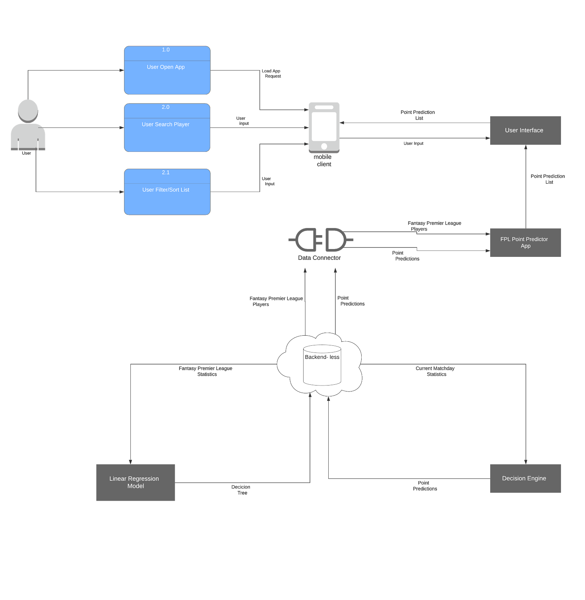

## CA326 Year 3 Project - Technical Specification
**Group Members**: Immanuel Idelegbagbon & Stefano Puzzuoli  
**Project Title**: Fantasy Premier League Point Predictor  

### Table of Contents
1. **Introduction**  
  1.1. Overview  
  1.2. Glossary  
2. **System Architecture**  
  2.1. Architecture Diagram  
  2.2. Presentation Layer  
  2.2. Business Logic Layer  
  2.3. Data Layer  

3. **High Level Design**  
  3.1. Data Flow Diagram  
4. **Problems and Resolution**  											
5. **Installation Guide**  
  5.1. Minimum Requirements  
  5.2. Download Instructions  
  5.3. Execution Instructions  
     5.3.1. Emulator Execution  
     5.3.2. Real-Device Execution  											
6. **Feature Selection and Analysis**  	

7. **Testing**  
  7.1. Accuracy Testing  
  7.2. Unit Testing  
  7.3. Instrumentation and UI Testing  
  7.4. Integration Testing  
  7.5. User Testing  

### 1. Introduction 
#### 1.1. Overview
The product to be discussed is a Fantasy Premier League Point Predictor Application. It consists of an Android app that, founded on the Fantasy Football statistics of the past and current (up and including the last played gameweek) season match fixtures of the Premier League, will formulate a point prediction for each individual player in a finite set of 312 players, on each individual matchday, throughout the football year.  

For each upcoming matchday, the application will allow the user to visualize an ordered list of the selected players of the Premier League, associating to each one their predicted points.  

The application will not allow the users to manage their Fantasy Football teams (e.g. set their weekly-line up, transfer players, set their captain, etc.), alternatively, its aim is to assist them in their decisions when setting up their weekly line-up.  

The App consists of a machine learning algorithm which uses a Linear Regression Model to make these predictions for each player. The 312 players were selected based on the minutes played and this set includes all the players that had played at least 1 minute in the current season of the Premier League up and until 03/02/2020.  

Users of the FPL Point Predictor App will be able to visualise a list containing all the players and their respective point predictions for the upcoming gameweek and will be able to sort these in their preferred order (ascending or descending) based on the player names or point predictions. Additionally, a search feature allows users to find any player present in the list, simplifying the user experience.  

### 1.2. Glossary
**Architecture**: the makeup of the product/system.  
**API**: Application programming interface.  
**App**: mobile application.  
**Client**: a third-party app used to play fantasy football.  
**Decision tree**: a decision tree is a decision support tool that uses a tree-like graph or model of decisions and their possible consequences, including chance event outcomes, resource costs, and utility.  
**Fantasy Football**: a competition in which participants select imaginary teams from among the players in a league and score points according to the actual performance of their players.  
**FPL**: Fantasy Premier League.  
**FPLPP**: Fantasy Premier League Point Predictor.  
**Line-up**: the list of players taking part in a game.  
**Machine Learning**: application of artificial intelligence (AI) that provides systems the ability to automatically learn and improve from experience without being explicitly programmed.  
**Matchday**: the day on which a particular football match takes place.  
**mBaas**: Mobile Backend as a Service.  
**Points**: the accumulated score a player receives each week.  
**Premier League**: top level of the English Football league system.  
**SQL**: Structured Query Language.  
**UI**: User interface.  

### 2. System Architecture  
#### 2.1. Architecture Diagram

  

The above architecture diagram is a representation of how the product interacts with users, entities and data sources. The diagram includes three layers. These layers depict a breakdown of the various components that make up the product. The first layer is the presentation layer. This layer contains components related to user interaction with the application. Next is the business logic layer, in which we find the core functionality of the application. Finally, the lowest layer called the data later, contains components responsible for communicating with the data storage.  

#### 2.2 Presentation Layer  
This layer remains unchanged from the previously revised version in the functional specification. The Presentation layer is responsible for displaying data. It consists of the user interface component, the user and the mobile client. The user interface is the only means for the user to interact with the application. The user does this by using their mobile client to access and utilise the features offered by the user interface. Data usually flows from the application to the user but in some cases the user can also input data into the application.  

These cases are:
1. Choosing a way to sort the list of player predictions. These options are provided by the app and include sorting by player name and by point predictions.
2. Inputing a player’s name in the search bar to search for a specific player’s prediction.

#### 2.3 Business Logic Layer  
This layer has changed slightly during the implementation from what was previously projected in the functional specification. Within the business logic layer still lies the main function of the product. This is the FPL Point Predictor App along with a script to provide automation and the data connector. The data connector is an API that is provided by Backendless. Backendless is the option that was opted for in order to handle backend functionality. See 2.4 Data Layer for further information. The Business Logic layer provides data that is required by the presentation layer. It is also responsible for fetching data from the Data layer and performing necessary tasks with the data via the script. The data is then either sent to the Presentation layer or back to the Data layer. The data is transferred to and fro using the data connector. In the case of the product at hand, data will consist of players and their predicted points.  

#### 2.4 Data Layer  
This layer has changed considerably. The original plan of using a cloud database and server combination to store and manage the data was traded for a simpler and straightforward option. A mBaas called Backendless was used to handle all backend workings. Backendless includes an SQL driven database, file storage and ways to visually construct the aforementioned logically, without using code. Stored on Backendless is all data regarding previous and current Fantasy Premier Leagues matches, the machine learning algorithm that will be used to create a decision tree and the decision engine that will be used to predict points. The machine learning algorithm has also changed from one proposed in the functional specification. After implementation it could be seen that a Linear Regression model yielded better results than a model made with the Bagging with Random Forests algorithm. Hence, a Linear Regression model was used. The Backendless database will be updated weekly with new data regarding the current Fantasy Premier League using a script mentioned in 2.3 Business Logic Layer. The machine learning algorithm will build the decision tree using data from the database. Once the tree is built, new data for the current matchday will be passed into the decision engine and point predictions will be made. These point predictions will be stored on the database, ready to be fetched by the Business Logic layer. This process will be repeated weekly for each matchday.   

### 3. High-Level Design  
#### 3.1 Data Flow Diagram  

  

#### 3.2. Language Choices
Python 3 is the programming language used to deal with all the calculations involving the machine learning algorithm and data manipulation due to its great library ecosystem for AI, helpful visualization tools and its flexibility.  

The application was developed in Android Studio, the official integrated development environment for the Android operating system and the programming language used for the user interface and interface background tasks is Java, due to the many advantages that it offers in Android app development.

### 4. Problems and Resolution
During the development of the Fantasy Premier League Point Predictor a few issues arose, with some being more drastic than others in regards to time, effort and complexity of the solution or workaround. Some of the issues and problems (with associated solutions) encountered throughout the project were the following:  

##### 1. Finding the players data set  

**Problem**: Machine Learning depends heavily on data, since without data, it is impossible for an model to learn and for this it is one of the most crucial aspects that makes algorithm training possible. When creating such a prediction model, finding and obtaining  the correct data necessary is a key step of the entire project. The data we required regarded Premier League players performances from the last and current season, as we needed it to train and test the model we were going to create. Initially we struggled to find such data, as all the data sets we found had something missing or some particular issue.  
 
**Solution**: Finally, after intense searching and snooping, we were able to find the very needed data for each player from the official API of the Fantasy Premier League website (http://fantasy.premierleague.com//api/bootstrap-static) which proved to be a significant help as without such a data set, we were struggling to make progress.  

##### 2.  Obtaining the players data from the FPL API  

**Problem**: Once we had found the long awaited player data set which we desperately needed, we believed all our problems regarding the data were solved but this revealed not to be the case. When retrieving said data, we discovered that the FPL API uses security measures to avoid bots from retrieving this data so when simply using a JSON request method, the API would block us after having obtained a certain amount of player data (not all).  
 
**Solution**: To deal with this issue, after numerous different attempts, we were able to figure out a solution which would “trick” the API and allow us to retrieve all needed data. The API has data in the JSON format and  we used a requests method  to grab data from the API and then feed it into a Dictionary, but when sending these requests, we created a loop to extract data from the API for all the 624 players and saved it as a list after using a random sleep parameter, which avoided being blocked by the API. This solved our problem and allowed us to obtain all the player data necessary which we then wrote into a CSV file.  

##### 3. Selecting the features for the prediction model  

**Problem**: One of the main issues when creating our prediction model was knowing which features to base it on and select from the player data set. We had a total of 58 columns/features in our set and limiting these and selecting which ones to use and which to discard was a difficult task.  
 
**Solution**: We initially started by eliminating the obvious ones, which did not provide any insight to our model/prediction like “photo”, “team_name”, “current_fixture” etc. 
We then eliminated the variables which we knew had a direct relationship with the Y variable,  meaning the variables which are used to calculate the “event_total” score for a particular player which were “goals_scored” and “assists”.
We then tried plotting some scatter plots to observe any relationship between remaining features and the Y and eventually using our domain knowledge and learning from data exploration, we started to create a model with 6 features: 'points_per_game','now_cost','selected_by_percent', 'interaction_term1','interaction_term2', 'ict_index'.  
Given the multicollinearity graph we also learned that there is collinearity between “value_form” and “form” and also between “value_season” and “form”, thus we made two interaction variables between these variables and decided that these selected features were adequate for our model.  

##### 4.  Players with 0 minutes not contributing to the model  

**Problem**: After careful data exploration we noticed that the players in the FPL API data set that had never played any minutes were not contributing to the prediction model being created thus were not necessary.  
 
**Solution**: Once we became aware of certain players not contributing to the model, we decided to remove said players from the Pandas Data Frame being used by sorting it on criteria players_df.minutes> 0.
We then fed that data into a new CSV (regular_players.csv)  and then read this new data set into another pandas dataframe called regular_players_df and used this to create the model.  

##### 5.  Random Forest model not accurate enough  

**Problem**: In our initial project design, it had been established that the classification algorithm which was going to be used for our model was the Random Forest algorithm, since at the time we felt it would adequately suit our problem. When we actually created our model with this approach, we used a Random Forest Classifier Model over the data and performed Cross Validation over 5 folds, but,  when testing and verifying the model, we felt like the accuracy was not to the standards we were hoping to reach.  
 
**Solution**: As an alternative, we thought about how we were predicting a continuous variable as our output and decided to use a Linear Regression Model with Cross Validation over 5 folds here too. The model was made using the 6 input variables we identified earlier including the interaction terms and set “event_total” as our y variable.   	 	
We then used Root Mean Squared Error (RMSE) as our evaluation metric (as we did for the Random Forest Model) and the RMSE gave the average over 5 folds, of the overall error of the predictions against the actual values. After we fine-tuned the model to get the RMSE as low as possible, it was clear that this model was much more accurate than our previously created one so we decided that the Linear Regression approach was the way to go.  

##### 6.  Missing “position” feature from data set (needed to view players by position)  

**Problem**: One of the main issues we encountered with the data set we retrieved from the FPL API was that amongst the 58 features/columns that were available for each player, the “position” feature was not one of them, causing the issue of not being able to distinguish goalkeepers, defenders, midfielders and attackers. This did not cause any problems regarding the creating the prediction model but it was still an issue as we had initially planned to allow users to view players in separate lists according to their position.  
 
**Solution**: To solve this problem we had initially considered scraping data from the official Premier League site to associate a position to each player in our list but due to the different formatting of the player names and other information this solution was not an option. At this point we had to settle and we decided to allow users to only view players in the one single list containing all the players we are making predictions for and thought that the search feature that our app includes would be enough to find and compare players if needed.  

##### 7.  FPLPP Title and Sort By Text not fitting when Search View expanded  

**Problem**: Regarding the UI, when everything seemed to be fully functioning as desired we encountered a bug which involved the “FPL Point Predictor” Title and the “Sort by” Text View breaking when the “Search” Search View was clicked and expanded by the user. When this occurred, the said title and text view would be cluttered and distorted in the top left corner of the UI, with certain words appearing off the row they were supposed to stay within.  
 
**Solution**: We were aware that this could be solved in different manners but we just had to decide which solution to adopt. After careful consideration, we decided that the way to go was to edit the code which would be executed when the Search View was clicked and we made changes that brought the attributes of the “FPL Point Predictor” Title to be modified in a way that it would no longer appear when the Search View is extended, thus leaving just the “Sort by” Text and the expanded Search View on the row.  

##### 8.  Default Android Studio Toast not accessible given our UI background  

**Problem**: An additional issue we encountered when it came to the UI of the App regarded the default Toasts (messages) of Android Studio. We were using these messages to inform users on activities being performed in the background or activities which had been completed such as “Loading player” or “Players sorted by Player Name (ascending)” etc.  
The issue was that the background colour (white) and text colour (grey) used by the default Android Studio Toast did not provide a sufficient level of accessibility given our background colour (also white).  
 
**Solution**: To solve this problem, since Android Studio does not have any trivial way of changing the colours in its default Toast, we had to create a custom toast ourselves by implementing a custom_toast.xml layout and a CustomToastUtil class which allowed us to create a Toast with blue and green colours which matched our official App colours, while also providing high level of accessibility.  

##### 9.  Adding automation of predictions for each gameweek  

**Problem**: Once our App was completed, we had to deal with the huge issue regarding the automation of the predictions for each Gameweek. One of our first problems regarding this was automatically solved since we use the official FPL API for the statistics of each player and these are updated each week on the same URL, allowing us to not need to focus on this aspect. The bigger problem was automating knowing when these new statistics would appear and when our App would have to show predictions for the new gameweek.  
 
**Solution**: Ideally, our App would display the point predictions for a specific gameweek from the first day after the last game of the previously played gameweek until the first day after the last game of the current gameweek is displayed. This would not have been too difficult to automate if the gameweeks of the Premier League were only disputed on each Saturday and Sunday but as we know, this is not the case. Unfortunately in some weeks gameweeks occur midweek and in other occasions on random days associated to Holidays (e.g. Boxing Day). As a solution, we were able to automate every aspect of the App, from updating the prediction tree to retrieving the predictions from our Cloud Serverless Backend, but the only thing we were not able to automate was knowing when these gameweeks occur. To solve this, we are required to run one simple Python script 3 days before any given gameweek, which we think is enough time for the Fantasy Managers to check our App and make their selections.  

### 5. Installation Guide  
The FPL Point Predictor App is only available to be downloaded on Gitlab from the following repository: https://gitlab.computing.dcu.ie/idelegi2/2020-ca326-iidele-fplpredictor .
#### 5.1. Minimum Requirements  
  - Android Studio 3.0
  - Android Gradle 5.0
  - Android Gradle Plugin 3.0
  - Android SDK 15
  - Android Build tool 29.0
  - Java Development Kit (JDK) 1.8
  - Java 8
  - Android Device or Emulator (min: API 15; max: API R)
  - Internet Connection

#### 5.2. Download Instructions  
1. Visit our repository at https://gitlab.computing.dcu.ie/idelegi2/2020-ca326-iidele-fplpredictor 
2. Click the download button on the top right corner of the page, here there will be the options to download the source code as zip, gar.gz, tar.bz2, tar. Select the preferred option.
3. Extract the downloaded files in a folder of your choice which will then contain a folder named 2020-ca326-iidele-fplpredictor which will contain our FPLPP App.

#### 5.3. Execution Instructions  
##### 5.3.1. Emulator Execution  
1. Once the minimum requirements in 5.1 are matched and the steps in 5.2 have been completed, open Android Studio on the PC or laptop.
2. On the Toolbar, select Tools
3. Select AVD manager
4. Select Create Virtual Device.
5. To select a Device Hardware for your emulator, select any option within the Phone or Tablet category  (ex. Phone -> Pixel 3) and click Next.
6. To select a System Image, select any option between IceCreamSandwich (API 15) and Q (API 29) and click Next.
7. Give you AVD a name (can also leave the default name) and click Finish.
8. On the Toolbar, there is an option that allows one to select the AVD you want to run your device on, click this and then select the newly created AVD.
9. Click the Run button on the Toolbar and the emulator with the FPLPP App will run and allow you to use the App.  

##### 5.3.2. Real-Device Execution
1. Once the minimum requirements in 5.1 are matched and the steps in 5.2 have been completed, open Android Studio on the PC or laptop.
2. Plug-in your Android Device to Computer via USB.
3. Open the "Settings" App on the Device
4. Scroll down to bottom to find "About phone" item
5. Scroll down to bottom to find "Build number" section
6. Tap on "Build Number" 7 times in quick succession
7. You should see the message "You are now a developer!"
8. Go back to main "Settings" page
9. Scroll down bottom to find "Developer options" item
10. Turn on "USB Debugging" switch and hit "OK"
11. Unplug and replug the device
12. Dialog appears "Allow USB Debugging?"
13. Check "Always allow from this computer" and then hit "OK"
14. In Android Studio on your PC or Laptop click "Run" from the toolbar.
15. In the "Choose Device" window that appears, select the "Choose a running device" radio button, select the device, and click OK.
16. The App will automatically install and run on your device.  

### 6. Feature Selection and Analysis
One of the main issues when creating our prediction model was knowing which features to base it on and select from the player data set. We had a total of 58 columns/features in our set and limiting these and selecting which ones to use and which to discard was a difficult task.  

We initially started by eliminating the obvious ones, which did not provide any insight to our model/prediction like “photo”, “team_name”, “current_fixture” etc.  
We then eliminated the variables which we knew had a direct relationship with the Y variable, meaning the variables which are used to calculate the “event_total” score for a particular player which were “goals_scored” and “assists”.  
When creating the model we then encountered an issue regarding multicollinearity and as an alternative we created a Scatter Matrix and a Correlation Matrix plot for the remaining variables.  

We found that there was a high correlation between “ea_index” and “bps” and eventually by testing the model we realized that bps was worsening our prediction metrics, hence we decided to drop it.  

Following, given a Multicollinearity graph we also learned that there is collinearity between “value_form” and “form” and also between “value_season” and “form”, thus we made two interaction variables between these variables.  
We then tried plotting some other scatter plots to observe any relationship between remaining features and the Y and eventually using our domain knowledge and learning from data exploration, we started to create a model with the final confirmed 6 features: 'points_per_game','now_cost','selected_by_percent', 'interaction_term1','interaction_term2', 'ict_index'.  

#### 6.1. Features/Variables Names Explanation.
		
**Feature**	| **Explanation** 
--------|------------
event_total (Y variable) | Total points scored by that player in that week (event).  
selected_by	| The % of users who have that player in that team.  
value_form | Custom index denoting value of player compared to current form of the player.
value_season | Custom index term denoting value of the player compared to the form of the player based on all the previous rounds so far.
form | Custom index term denoting the current form of the player.
ea_index | Index created by the EA org. and used for ranking/comparing players, and it also changes based on the current performances of the player.
bps | Index denoting the ranking of players based on the bonus points scored by the players.	
now_cost | The cost of the player for that game week. This variable is affected by the form of the player.	
  
  
### 7. Testing 

#### 7.1. Accuracy Testing  
When starting our project consisting of the Fantasy Premier League Point Predictor, we knew that one of the most challenging aspects of the App was to guarantee a certain level of accuracy of our prediction model, especially since it was our first time learning about and tackling a Machine Learning related problem.  

The reason for which the accuracy level of our model was so important was due to the fact that accuracy is one of the key metrics for evaluating classification models and depending on the level reached, we would be able to classify our Point Predictor App as a success or a failure. For this reason, when creating our model, we were very careful and detailed when it came to analysing and selecting the features to make up the model, as they would make a significant impact in the final performance.  

Once our Linear Regression model was created, we had to find a way to evaluate it and measure its accuracy to verify if additional tuning was necessary or if we were satisfied with the reached results. To do this, we used the Root Mean Squared Error (RMSE) as our evaluation metric. The RMSE gave the average over 5 folds, of the overall error of the predictions against the actual values.  

The results obtained were around the 3.0 average but we felt like we could still improve and eventually, after some intense fine-tuning of our model, we were able to bring it down to an RMSE within 2.x range., with which we were very satisfied.  

We executed these accuracy tests involving the RMSE with a script which tested from gameweek 1 to gameweek 23 of the 2019/2020 season and obtained values of RMSE within the range 1.98 -  2.55. All these accuracy tests are stored in the directory code/backend/Testing/Accuracy_testing_results in two files, one as a simple text file and one as a CSV file.  

#### 7.2. Unit Testing  
Regarding the testing of the Python code which we used to obtain the FPL API data, restrict the number of features used and create the prediction model, we implemented unit tests for each basic step that the script involved, testing each functionality separately and together.  

To do so, we made use of Python’s PyUnit unit testing framework which allowed us to include test automation, sharing of setup and shutdown code for tests, aggregation of tests into collections, and independence of the tests from the reporting framework.  

Additionally, we also included Python’s Pandas Testing module which with the PyUnit functionalities, allowed us to test Data frames and Series.  

#### 7.3. Instrumentation and UI Testing  
With regards to the testing of the functionalities of the UI which were implemented in Android Studio, we made use of Instrumented unit tests which are tests that run on physical devices and emulators, and they take advantage of the Android framework APIs and supporting APIs, such as AndroidX Test.  

Functionalities for which we used Instrumentation and UI testing to verify were some such as getting data in the background (on Backendless), searching for player names in the search view, sorting the list view in different manners, running the Main Activity and many more.  

Our general approach was to use Instrumented tests for all cases where we needed to test against the behavior of a real device.  

#### 7.4. Integration Testing  
For the overall testing of our App we used a Continuous Integration Testing model. The setup of our CI contains a YAML script which is executed every time a commit is made to our repository.  

The CI configuration, when being executed verifies if the script executes successfully and if this occurs, the commit passes, alternatively it fails.  

Overall we can say that the majority of the features and classes of our App were tested, there were some minor ones which we did not feel necessary to test because they were trivial and we felt like taking time to write tests for basic methods (e.g. certain getters and setters to mention a couple) was an ineffective way of spending our resources.  

#### 7.5. User Testing  
Finally, we decided to also conduct some user testing through user evaluations.  

This user evaluation stage allowed us to classify the user Experience of our Fantasy Premier League Point Predictor App. By user experience we refer to the aspect of the user interaction with the product, and more specifically how a user perceives the system before, during and after interacting with it. Since user experiences are subjective to the specific individuals, it was necessary that we conducted evaluations with the right extent, constructs, and methods to enable the data and information received from these studies to assist us in the dimension we required.  

To evaluate our system, we decided that a heuristic evaluation and a user evaluation of our App through focus groups was sufficient to provide us the information that we were looking for regarding the user experience.  

By answering adopting such method, we were able to get a general collection of opinions and thoughts about the App, highlighting areas in which improvements were required and areas which we had designed adequately which users were satisfied with.  

Official documentation about our user studies are present in our repository where it is possible to find documents about our  User Evaluation, Heuristic Evaluation, Focus Group Questions and more.  

