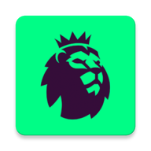
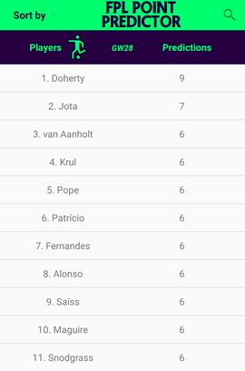
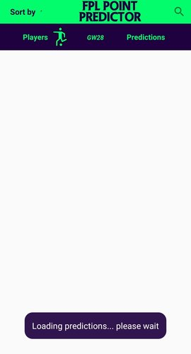
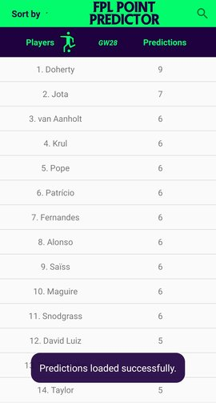
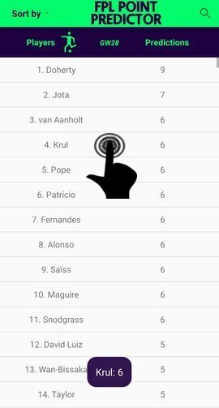
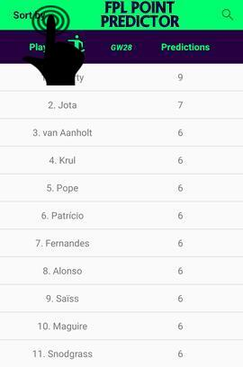
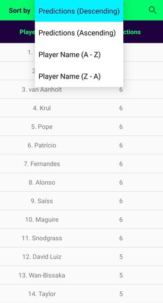
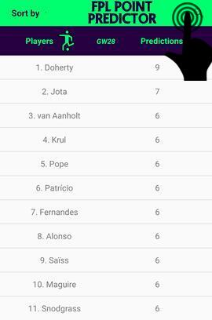
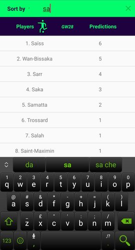
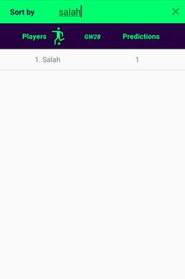

## CA326 Year 3 Project - User Manual
**Group Members**: Immanuel Idelegbagbon & Stefano Puzzuoli  
**Project Title**: Fantasy Premier League Point Predictor  

### Table of Contents
1. **Introduction**  
  1.1. Overview  
  1.2. App Icon  

2. **Installation Guide**  
  2.1. Minimum Requirements  
  2.2. Download Instructions  
  2.3. Execution Instructions  
     2.3.1. Emulator Execution  
     2.3.2. Real-Device Execution    

3. **App Information**  
  3.1. General Information  
  3.2. App Permissions  

4. **App Usage Guide**  
  4.1. General Layout  
  4.2. Loading Predictions  
  4.3. Predictions Loaded  
  4.4. Click Player/Prediction in List  
  4.5. Sort By Button  
  4.6. Search Button  

### 1. Introduction  
#### 1.1. Overview  
Fantasy Premier League Point Predictor is an application that runs on Android smartphones. The app displays a list of players and their point predictions for the Fantasy Premier League. The intended use of the app is to give users an idea of which Fantasy Premier League players will perform well in each week of Fantasy Football. Users can then choose whether or not to include these players in their Fantasy Football team. Ideally, the FLPPP will give users an edge over Fantasy Football users who do not use FPLPP. Of course, the app is available to be installed by all who wish to avail of its features, which include:
  * Accurate player point predictions.
  * Clear display of player point predictions via a list view.
  *  Option to sort list of players in various ways.
  * Option to search for specific players and their point predictions.  

#### 1.2. App Icon  

  
&emsp;&emsp;&ensp;**FPL Point Predictor**
  
  
### 2. Installation Guide  
The FPL Point Predictor App is only available to be downloaded on Gitlab from the following repository: https://gitlab.computing.dcu.ie/idelegi2/2020-ca326-iidele-fplpredictor .
#### 2.1. Minimum Requirements  
  - Android Studio 3.0
  - Android Gradle 5.0
  - Android Gradle Plugin 3.0
  - Android SDK 15
  - Android Build tool 29.0
  - Java Development Kit (JDK) 1.8
  - Java 8
  - Android Device or Emulator (min: API 15; max: API R)
  - Internet Connection

#### 2.2. Download Instructions  
1. Visit our repository at https://gitlab.computing.dcu.ie/idelegi2/2020-ca326-iidele-fplpredictor 
2. Click the download button on the top right corner of the page, here there will be the options to download the source code as zip, gar.gz, tar.bz2, tar. Select the preferred option.
3. Extract the downloaded files in a folder of your choice which will then contain a folder named 2020-ca326-iidele-fplpredictor which will contain our FPLPP App.

#### 2.3. Execution Instructions  
##### 2.3.1. Emulator Execution  
1. Once the minimum requirements in 2.1 are matched and the steps in 2.2 have been completed, open Android Studio on the PC or laptop.
2. On the Toolbar, select Tools
3. Select AVD manager
4. Select Create Virtual Device.
5. To select a Device Hardware for your emulator, select any option within the Phone or Tablet category  (ex. Phone -> Pixel 3) and click Next.
6. To select a System Image, select any option between IceCreamSandwich (API 15) and Q (API 29) and click Next.
7. Give you AVD a name (can also leave the default name) and click Finish.
8. On the Toolbar, there is an option that allows one to select the AVD you want to run your device on, click this and then select the newly created AVD.
9. Click the Run button on the Toolbar and the emulator with the FPLPP App will run and allow you to use the App.  

##### 2.3.2. Real-Device Execution
1. Once the minimum requirements in 2.1 are matched and the steps in 2.2 have been completed, open Android Studio on the PC or laptop.
2. Plug-in your Android Device to Computer via USB.
3. Open the "Settings" App on the Device
4. Scroll down to bottom to find "About phone" item
5. Scroll down to bottom to find "Build number" section
6. Tap on "Build Number" 7 times in quick succession
7. You should see the message "You are now a developer!"
8. Go back to main "Settings" page
9. Scroll down bottom to find "Developer options" item
10. Turn on "USB Debugging" switch and hit "OK"
11. Unplug and replug the device
12. Dialog appears "Allow USB Debugging?"
13. Check "Always allow from this computer" and then hit "OK"
14. In Android Studio on your PC or Laptop click "Run" from the toolbar.
15. In the "Choose Device" window that appears, select the "Choose a running device" radio button, select the device, and click OK.
16. The App will automatically install and run on your device.  

### 3. App Information  
#### 3.1. General Information
1. **Version**: 1.0
2. **Download size**: 3.65 MB
3. **Created by**: Immanuel Idelegbagbon & Stefano Puzzuoli
4. **Category**: Sports
5. **Content Rating**: PEGI 3  

#### 3.2. App Permissions
Version 1.0 of the App may request access to:
* Internet Access
* Network State Access
* Receive data from the Internet

### 4. App Usage Guide
#### 4.1. General Layout  

  

The above image shows the general layout of the FPL Point Predictor App.  

Once the App is launched and all players are loaded, the user will be able to visualise a list of all said players and their corresponding predictions for the upcoming gameweek.
The left column shows the position of the players and the player names, while the right column shows the point predictions associated to each player.  

Between the “Players” and “Predictions” column headings there will be be a “GW#” heading which indicates the upcoming gameweek for which the predictions are made (In the image above is GW28).  

In the top left corner of the App is a ”Sort By” button which when clicked allows to sort and view the list of players in different manners.  

In the top right corner of the App is a “Search” button which allows to search for any player (and associated prediction) present in the list.  

Finally, in the middle of the top row of the App is an “FPL Point Predictor” title which represents the official name of the Application.  

#### 4.2. Loading Predictions  

  

When the App is launched, the general layout of the App will be displayed but the user will be informed, via a message which will pop up on the screen, that the Predictions are being loaded and the user must wait (generally will take 2/3 seconds) until they are retrieved. The message that will appear is shown in the image above and says “Loading predictions… please wait” and will disappear after a couple of seconds.  

#### 4.3. Predictions Loaded

  

Once the Predictions have been loaded successfully by the App, all players and corresponding predictions will appear in a list (sorted by default in descending order of the Predictions) and the user will be informed that this has occurred via a message that will pop up on the screen saying “Predictions loaded successfully.” which will also disappear after a couple of seconds.  

#### 4.4. Click Player/Prediction in list  

  

When the list of Players and Predictions is fully loaded, the user can scroll through the list to visualise predictions for all the players of the Fantasy Premier League. Additionally to simply viewing the players, the user can also click on each entry of the list and when so occurs, a pop up message will appear on the screen containing the Player name and the associated Point Prediction.  
In the image above, we can see how when the user touches the 4th row in the list, the message “Krul: 6” appears, indicating that the Player named “Krul” has a point prediction of “6” points for gameweek 28.  

#### 4.5. Sort By Button

  

  

Additionally to viewing the Players/Predictions in a list sorted in descending order of the Predictions, the user can also click on the “Sort by” button in the top left corner of the screen as seen in the first of the two images above, causing a drop down menu to appear, which will contain the options to sort the list by “Predictions (Descending)” (which is the selected one in the images above), “Predictions (Ascending)”, “Player Name (A - Z)” or “Player Name (Z - A)”. The user can select any of the 4 options and will receive a confirmation via a pop up message on the screen of the selected choice, after the new sorted list is displayed.  

#### 4.6. Search Button

  

  

  

Finally, one of the last features of the App is the Search functionality.  
In the top right corner of the App is a Search button represented by a magnifying glass icon, if this button is clicked as we can see in the first of the three images above, the user will be able to enter the name of the Player they are looking for and said player will appear in the list. An additional functionality of this feature is that while the user is entering the searched name, players that match with the currently entered name will start to appear as we can see in the second image above, where the user has entered “sa” and all players that have “sa” in their name start to appear in the new list.  
Finally, when the player enters the entire name of the player they are looking for, in the example above “salah” the only player that matches will appear.  
An important aspect of the search functionality is that the user can enter the player names without needing to use capital letters as the search feature is case insensitive.

